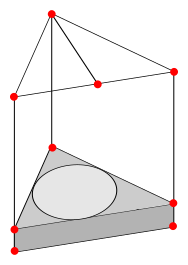
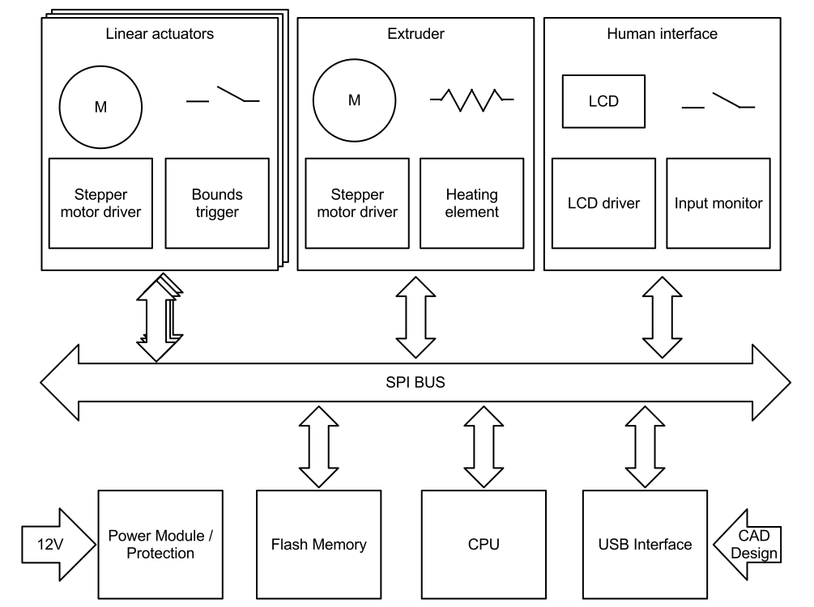

Design Strategy
===============

The hardware design will be in the form of a delta machine. These devices can perform fast accurate tasks as the light-weight print head is capable of quick acceleration. This design has been adopted from a current reprap project<cite>5</cite>. The delta machine will use less parts then a traditional Cartesian machine.

For a detailed overview of this projects design please refer to the [Project Report](/report)

Hardware
--------
{width=40mm}

The frame will be constructed with aluminium beams. It have a small enclosed area for the electronics and power supply. The printer bed is mounted on top of the case. There is a beam on the top level that intersects the face in half. This is primarily for a place to mount the plastic feeder but also serves as a structural support beam. The joins will be printed on another 3D printer. Their design will facilitate modifications.

Electronic Systems
------------------

The electronics will consist of many smaller systems working in unison. This means we require multiple low-powered microcontrollers opposed to one powerful central processing unit. The system can be improved after it has been manufactured by connecting additional devices to the SPI bus.

Software
--------
Both software for a host computer and for the actual device will need to be developed.

A slicer application that breaks three dimensional CAD designs into multiple two dimensional frames is required. Drivers for connecting to the printer and communicating with its sensors and diagnostics is essential. A simple protocol needs to be created that allows a host computer to queue a CAD design for print is also needed.

The printer needs to be able to translate the sliced CAD designs into instructions that will command each actuator and allow the platform to follow a desired path. A control system will need to monitor and manipulate the extruder temperature. Finally the printer must be able to communicate with a host device. 
