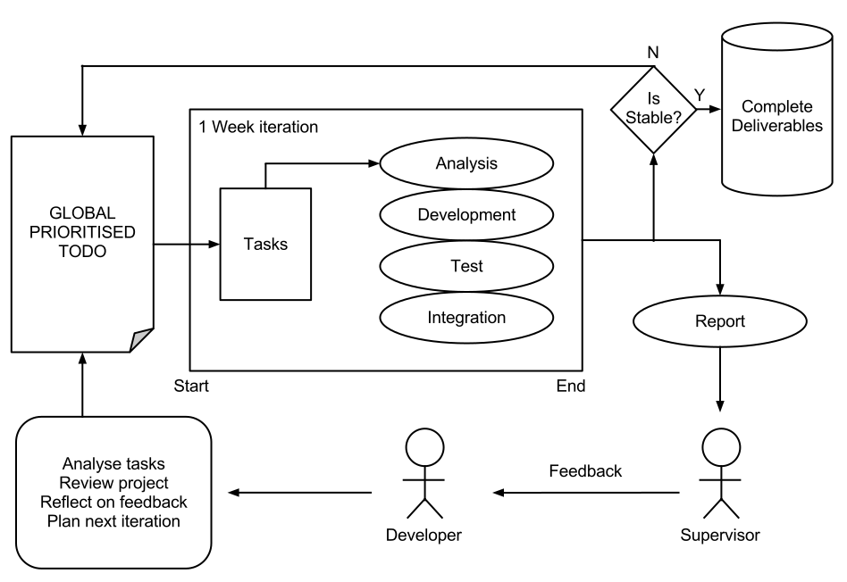

Development strategy
====================

The 'Agile Development' method will be utilised during the project. It will help promote fast and adaptive development. Agile development starts with a large list of tasks, these are generally broken down into individual modular components.

An iterative process is performed once a week. It consists of:
* Select the most valuable task from the global task list.
* Analyse the task
* Develop
* Test
* Integrate
* After one week is over report back to supervisor

After an iteration the next week must be planned by:
* Analyse the last tasks status
* Review the whole projects status
* Commit changes to production code base (if goals were satisfactory)
* Plan next iteration (select more tasks or continue on current)
* Reflect on supervisor's feedback.

The benefit of a scrum like method is that it will allow us to be far more  responsive to unseen problems that may arise. The projects primary goals can possibly be modified during project development if something does not go to plan or even if a new technology / discovery is made.
