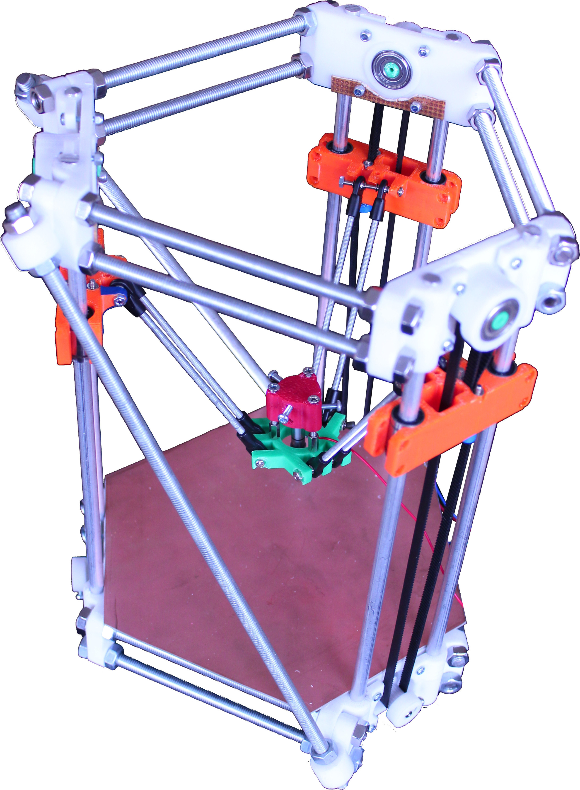

Conclusion
==========

The macro and micro effects of an introduction to a personal manufacturing device is fascinating. It has the possibility to facilitate innovation in many areas. 
Whether it is a domestic or commercial application, 3D printing can help produce specialised parts, reduce prototyping time and cost, promote first hand recycling and entice the next generation into a technical field.

Low cost additive manufacturing is still in early development. A young underdeveloped device or idea presents an opportunity for improvement. This technology will continue to advance as demand increases. The delta style of 3D printers already is faster and more accurate then the traditional Cartesian machines.

{width=60mm}
