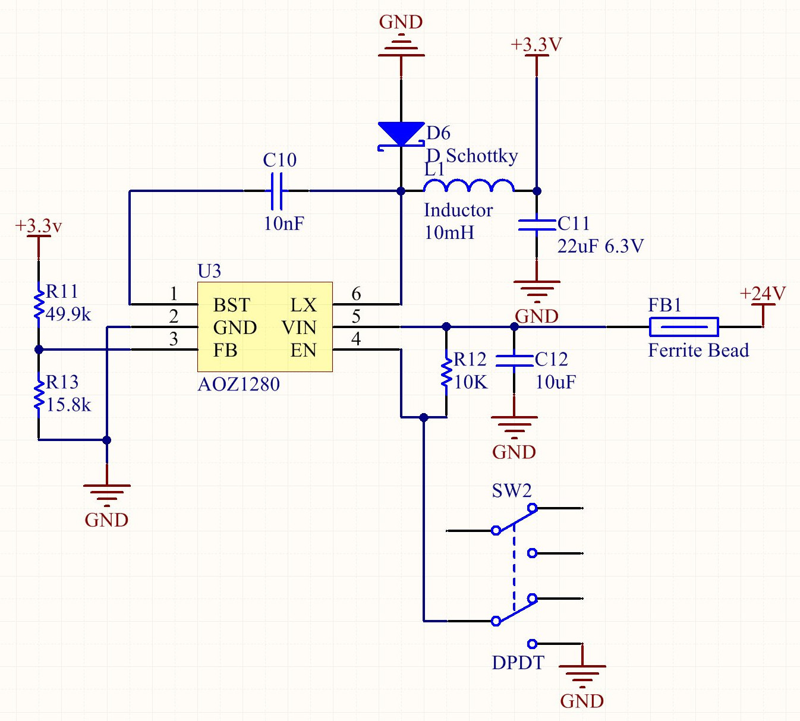

Power
====

The AOZ1280 from  Alpha \& Omega Semiconductor is a 1.2A buck regulator. It is configured to +3.3V by using a resistor divider of 49.9K and 15.8K. 1.2A is more then enough to power all the logic and LEDs. Since the whole system is dependent on this switched, we can control the system's power by toggling the buck regulators enable pin. This means that we can use a very small chip and avoid large heavy duty power switches.

The Stepper drivers also require a 12V to 24V supply for the internal FETs. Status LEDs indicate both the 12V and 24V rail status. Currently 12 volts is brought in through a standard DC barrel jack.

