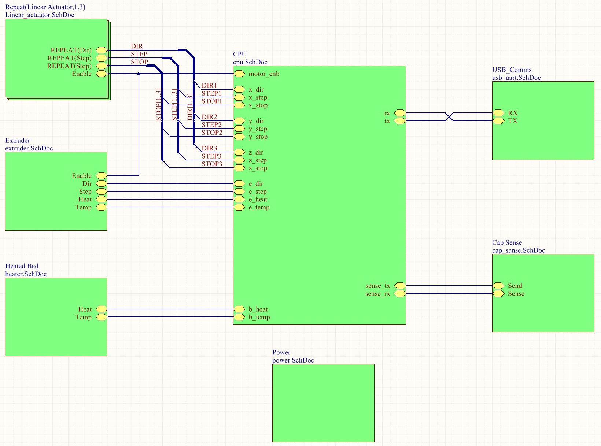

High Level Diagram
===================

Efficient circuit board design was achieved by using the hierarchy model. The numerous duplicated parts can be abstracted and then replicated the desired amount. This also makes managing a large project far easier. This also speeds up circuit board development since that we only need to lay tracks for a single component and then propagate them to similar 'rooms'.

Examining the top level diagram, we can see that the each of the three actuators utilise two components; the stepper driver and a end stop. The extruder component contains one stepper driver and also heater circuity, while the heated bed only holds a heater. 

