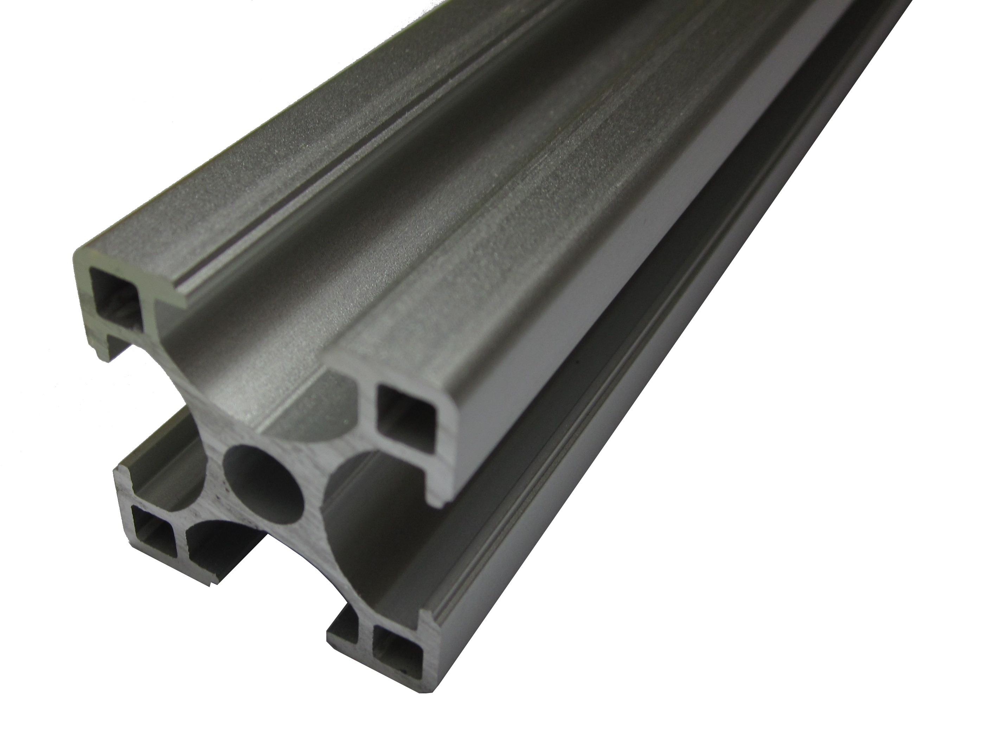
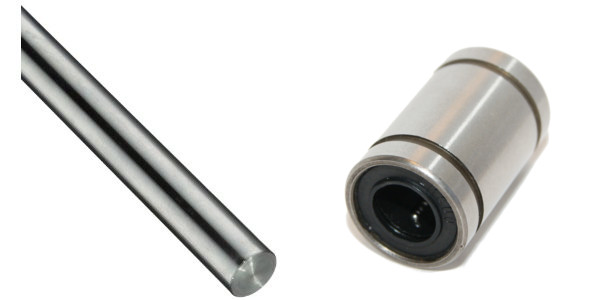
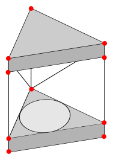

Frame
=====

The first iteration of design utilised aluminium to build the framework. It was selected due its strength and the modularity it offered during the prototyping stage.

{width=40mm}

Positives
- Very strong in any direction
- Simple mounting and joining
- Reusable
- Easy to modify / tune

Negatives
- Relatively expensive at $25 per meter
- Requires special cutting tools
- Hard to source

However during the initial design, it was decided that the carriage designs would be too complex which would violate one of our design goals. The very cheap and easily obtained 8mm threaded and smooth rods were used instead. This way we can use LM8UU linear bearings instead of investing a lot of time in hardware design.

{width=60mm}
Positives
- $3.3 per meter for stainless steel round bar
- $0.90 per meter for 8mm threaded rod.
- $0.75 per unit for LM8UU linear bearings.
- Easy to obtain from metal fabricators or general hardware stores
- Can cut with a hacksaw or angle grinder

Negatives
- Flexes in the horizontal direction

{width=40mm}

The frame will have a small enclosed area for the electronics and power supply. The printer bed is mounted on top of the case. There is a beam on the top level that intersects the face in half. This is primarily for a place to mount the plastic feeder but also serves as a structural support beam.

We will need to know how much material to order. There is 4 equilateral triangles with side lengths of #D#  and there are 4 rails that need to be of #D#. 
##M_{threaded} = 3(4D) + 2(D\sqrt{3}) ##
##M_{smooth} = 3(2*2D)  ##
To minimise waste, #D# needs to be a multiple of the purchased material's length.  To further reduce waste, the purchased length should be close to a whole number.

