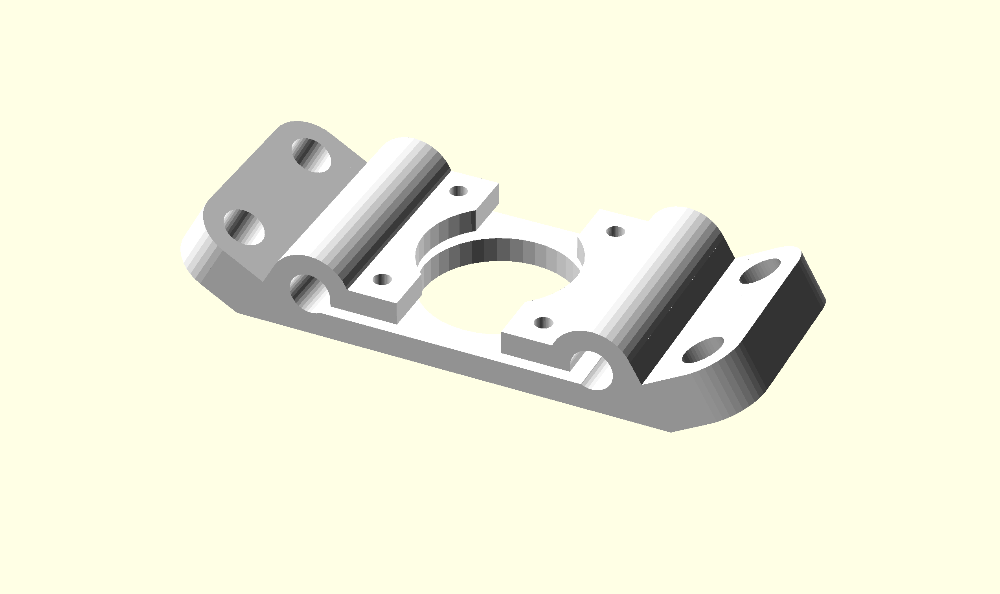
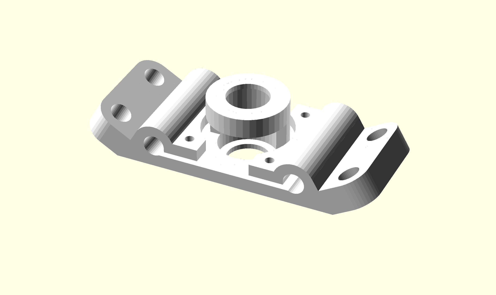

Frame Brackets
==============

Bottom Level
------------

{width=80mm}

This design was an attempt to reduce the part count by incorporating as much functionality into a single piece. Firstly, the 4 holes on the outer perimeter are for threaded rods that will connect to other brackets that will form the base of the equilateral triangle. The clamps in the centre hold on to the parallel smooth rod that form the linear actuator and that attach to the top brackets. The screws that put pressure on the clamps also couple the stepper motor to the bracket.

Top Level
---------
{width=80mm}

A symmetrical design allows us to recycle many similar parts. Comparing the bottom bracket to the top bracket we can see that the only difference is the recessed enclosure for a 608zz bearing. They are recessed  so that the bearings do not fall out during operation.

