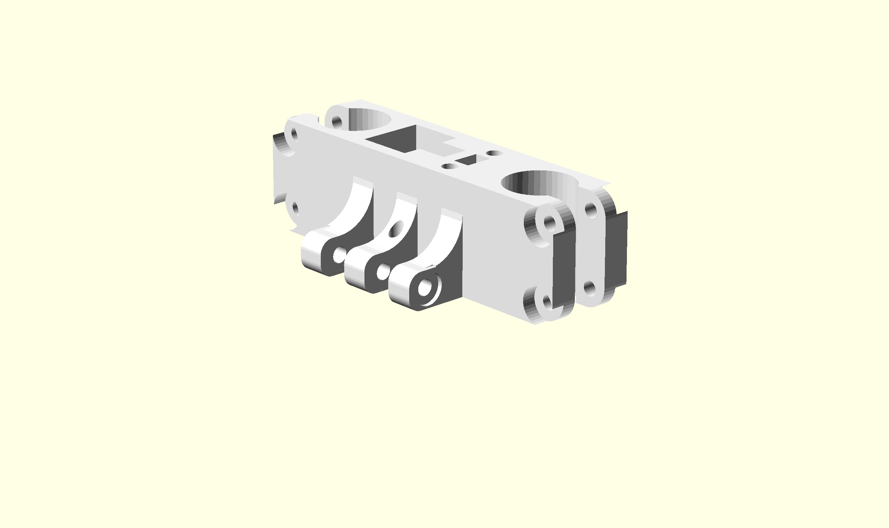

Linear Actuators
================

Carriage
--------
{width=80mm}

The outer holes with the relief cut mount LM8UU linear bearings. They are placed in with M3 screws clamping them into place tightly. A belt runs up through the centre with a small plate pressing against the frame fixing the belt to the carriage. The horizontal bore are where the linkages mount to. A 30mm M3 bolt holds the rod ends in place.

Belt Drive
----------
I have opted to use GT-2 belt with 2mm pitch. The GT-2 grooves are far finer then the original T2.5 x 5mm Belt. Finer grooves will help produce smoother motion. The belts are made from neoprene rubber and have  fibreglass reinforcing running through them.

Pulley and idlers
-----
The gears that match the belt were also printed. They were generated using the OpenScad [Parametric pulley library](http://www.thingiverse.com/thing:16627) by user ['droftart'](http://www.thingiverse.com/droftarts/designs) from Thingiverse. This is a great library, it offers great flexibility. The tooth profiles themselves are actually generated from the original manufactures DXF images.

The Pulley attaches to the stepper motor in the reverse orientation so that the lock nut is easily accessible and so the belt lines up with the top bracket. The idler is sandwiched between two 608zz bearings in the top bracket.

The gears must be perfect. It took a few trail runs before a straight tooth profile was obtained. The best printing settings are obviously fine, 0.25mm layer heights and full infill. Care must be taken when leveling the printing bed, it is actually better to have the bed slightly further down from the extruder so the higher layers do not clump together and warp during printing. 

{width=80mm}

Motors
------
Standard common Nema 17 stepper motors have been used in this design. They feature 1.8 deg/step ands are capable at driving a single coil with up to 2.5A. They can be obtained for $15 each.

They can provide plenty of torque and are typically powered with 12 to 24 volts. The Steppers that were purchased are a normal bipolar configuration with four leads. 

{width=80mm}

