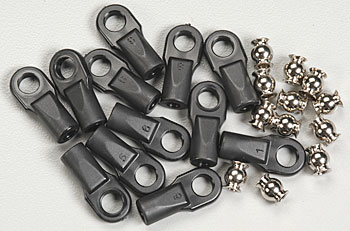

Linkages
========

The linkages are made up of 4mm threaded rod cut to a specific length. The rod is currently attached to 10mm Traxxas Rod Ends to allow movement between the carriages and the platform. These are originally for model RC car and are reasonably priced for their quality.

{width=80mm}
