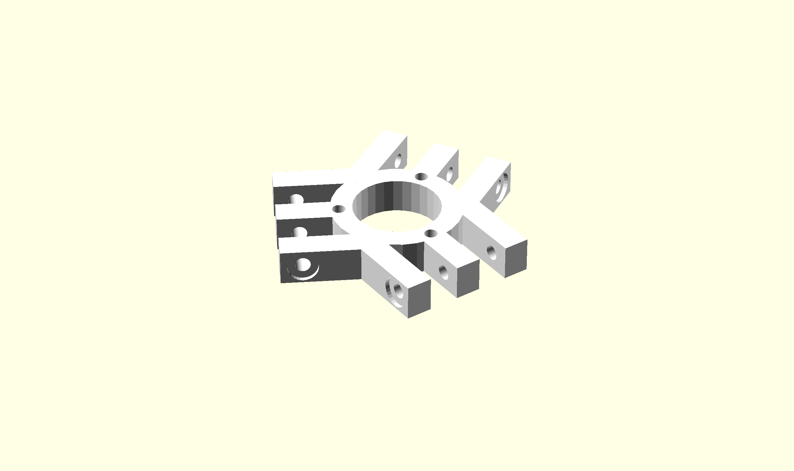

Platform
========

{width=80mm}

The platform is simply a base to mount a tool to while connecting each linkage to a linear actuator. In the Centre there are three holes that stand offs attach to. The outer holes are where the ball bearings are seated.

