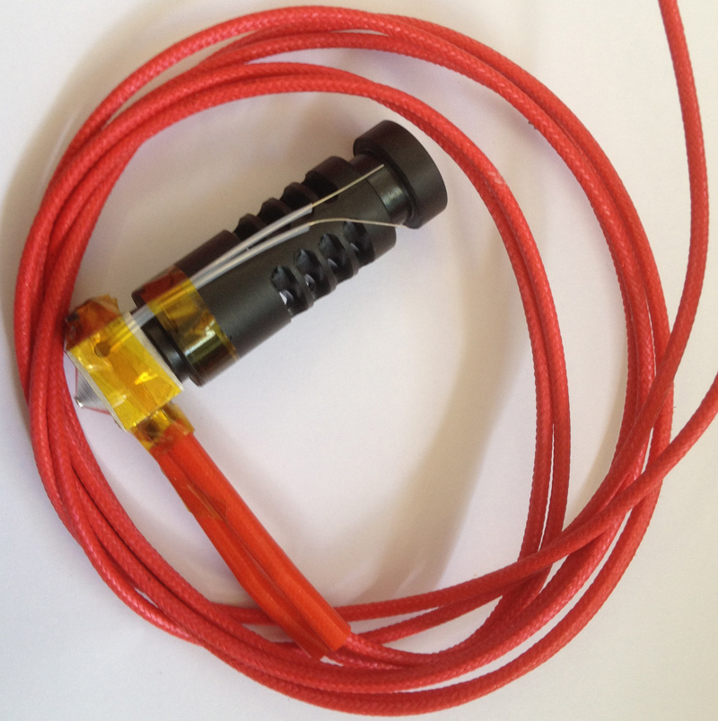
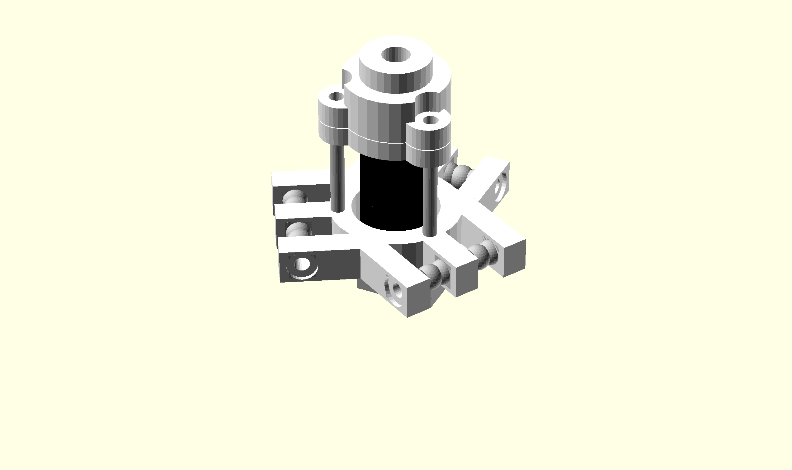
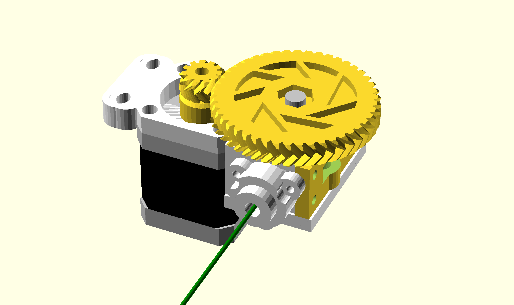

FDM Tool
========

Extruder
--------

The extruder that will be used is the inexpensive common J-head extruder. It features a PEEK nylon tube with ventilation holes to help reduce heat transfer up into the platform. The hot end is a block of aluminium for a light weight tool. A 100K themistor is embed in the block along side a 5.6 ohm, 1%, 5W resistor which is used as a heating element.

{width=80mm}

A clamp setup was developed to attach the extruder to the platform. Stand offs are used to space the extruder away from the platform so that the maximum printing depth is available. A tube clamp is fixed on top of the extruder for use with a Bowden feeder system (explained in the following section).

{width=80mm}

Bowden Filament Feeder
---------------------

A Bowden Filament feeder is a design that aims to reduce the weight on the tool end. The principle is by reducing the mass, we can increase the acceleration. By shifting a heavy direct drive stepper motor off the platform and fixing it onto a stationary point, we have greatly reduced the moving mass.

Instead of feeding filament directly into the extruder, it is fed first through a strong PTFE tube. The tube itself does not flex much so the force eventually builds up enough that the filament must push through the least resistances and that becomes the hot end.

A fair amount of force is required to push the filament through a length of pipe and through the extruder. This is why I have selected to use a geared configuration to increase my motors torque. A Herringbone gear arrangement is used as transfers power more evenly because more then two teeth mesh together at one time. They are also easily manufactured with 3D printing. The gears were borrowed from [robo\_kid22 on Thingiverse](http://www.thingiverse.com/thing:104615).

{width=80mm}

The design features a door like mechanism that is spring loaded to apply pressure on the filament. It pushes a bearing against a bolt that has had a rough surface machined into it. This provides good traction between the filament and does not slip. The filament is then fed directly into the tube which is coupled to the moving platform. The feeder is mounted on the top of the frame with a spool of plastic along side it.

