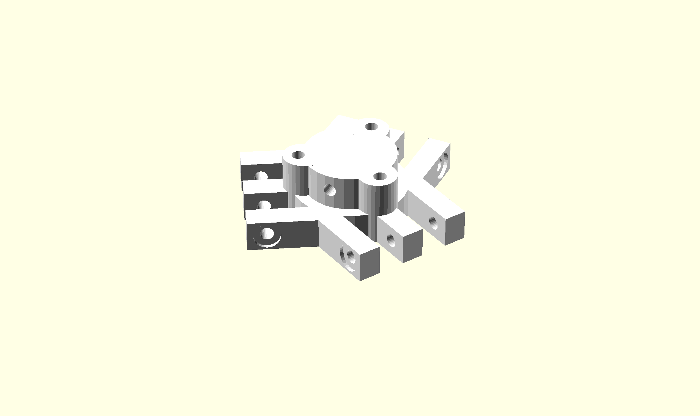

Plotter
=======

{width=80mm}

Before 3D printing, I wanted to be able to test and perfect the performance of the machine. A plotter attachment was developed so that the paths generated could be analysed. A barrel was designed to hold a normal ball point pen. The pen is cut in half and the spring is reversed so that it is always pushing against the target surface. Horizontal screws fix the pen in place and the vertical screws attach the plotter to the platform.

The metal tip of the pen has a wire soldered, this is to be used when automating the height calibration. The base is currently made from a copper plate which is kept at ground. The pen tip is pulled high with a 10K resistor, so if the tip meets the base the tip will be pulled low. We can detect the voltage change with our microcontroller. 

{width=80mm}
