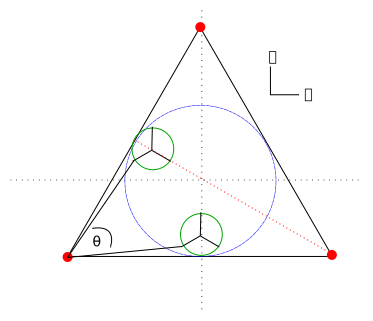

Constraints
===========

Printing Bed
------------
A design assumption was made at the beginning of this section; The platform can not be positioned outside of the frame. To force this rule to apply, we must set the linkages length equal to the minimum distance from a rail to a side of the frame. The maximum length required is a line straight down the y axis from the rail to the frame which is equal to #{\sqrt{3}\over 2}D#. If we swing the platform around, pushing it to the maximum radius that this length permits, we see that the path is not actually a circle but a rounded triangle. The light blue path in fig. ref[top-view-angle_diagram.svg] is the maximum positions. Such an unusual path is typically not needed, so we will simplify our problem by using a circular print bed.

To allow for a platform, we must subtract its radius from each of the linkages length. So, our rule for #h# is:
##h = {\sqrt{3}\over 2}D - r ##

Universal Joint Angle Range
---------------------------

{width=100mm}

The universal joints that will pivot to allow full movement will need to be capable of a certain range. This can be calculated exactly with:

## \theta = 60 - 2 \arctan{({  { {2 - \sqrt 3 }\over 2} r  \over  {1\over 2} D   } )} ##

Practically, we can simplify the problem by aiming for #60^{\circ}# in the horizontal direction and #90^{\circ}# in the vertical direction.
