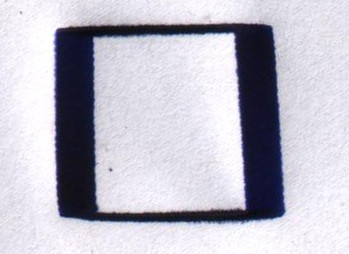

Repeatability
============

Repeatability is how consistently can the machine produce the same result. This is extremely important as each layer is dependent on the previous layer. If there is a slight error, it is possible that the rest of the print will not align up resulting a mess.

The following figure is the output of 100 iterations printing a #17mm^2# square. It is very noticeable that there is a large amount of drift over the #x# axis while the #y# axis has minimal variance. It is very important that the distortion is so consistent. It should also be noted that the top actuator (the one at #(0,D)#) has the majority of affect over the #y# direction. However, the x axis is affected by the two lower actuators equally.

This result may be caused by an algorithm error. But it also may be both actuators errors constantly adding up producing a uniform distortion. The ball point pen will also bleed through the paper increasing the thickness of the line.

These results were measured using a digital caliper. This test is not conclusive as the drift could be also correct itself. This would then appear to have little to no difference as the net sum of error would be zero. However, practically this correction would only occur over simple straight line objects. More rigorous tests need to be conducted in the future. A combination of larger and more complex prints should be examined.

| Variance | Result over 100 | Average |
|──────────|─────────────────|─────────|
|──────────|─────────────────|─────────|
| #x#      | 2.64mm          | 26.4um  |
| #y#      | 0.63mm          | 6.3um   |
	Drift results
